## 本文解决什么问题

两个问题：
- Session Isolation: 谁和谁的状态不能串
- Resource / Tool Isolation: 这个 session 到底允许操作哪些资源

一个真正能运行多任务的 Agent 系统至少要知道：这是哪个 Session、这个 Session 属于哪个工作区、能调用哪些工具、保存哪些历史。

## 1. 为什么需要 Session 隔离？

如果后端只有一个全局历史，考虑以下场景：

- 用户 A 说：“重构 ui.py”
- 用户 B 说：“查一下报错日志”
- 用户 C 说：“生成一份文档摘要”

结果：三条信息全部进入共享上下文历史当中。模型看到的可能就变成：

```text
user：重构 ui.py
assistant：...
user：查一下报错日志
assistant：...
user：生成一份文档摘要
assistant：...
```

LLM 并不知道这三句话其实来自三个毫无关系的人/对话/任务，因为对它来说，它看到的只是一个 token 序列。所以 Session 不是 LLM 能力，而是 Agent Runtime / Harness 提供的状态抽象。

你可能会很疑惑，这三条信息不是来自三个不同的来源吗？为什么会共享相同上下文？

实际上由于我们平时用的大多是成熟可用的 Agent，“不同会话天然隔离”已经由开发者做好了，我们平时几乎感知不到这层基础设施。但是从实现角度来看，这件事情并不天然。

假设一个 Agent 没有会话隔离，而且内部只有一个全局的 `history` 容纳对话历史，那么如果用户在 `project_A` 目录下说：“帮我修 main.py”，之后又切到 `project_B` 目录下说：“分析一下这个项目的登录逻辑”，那么模型会在记着 `project_A` 里的文件、错误、工具调用的情况下，接着去处理 `project_B`，这就是上下文污染。所以成熟的 Coding Agent 至少会显式区分：

- session_id
- workspace / cwd
- conversation history

常见关系可能是：

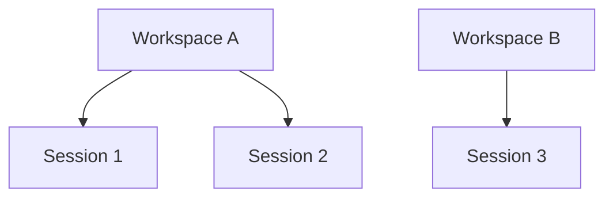

同样需要隔离的，最容易想到的就是 user 了。不同用户共享同一个上下文，这是不可饶恕的。所以这三者解决的是不同的问题：

- user_id：这是哪个用户
- workspace_id：用户正在操作哪套资源
- session_id：这是哪段独立对话/任务

## 2. Session：互不干扰的格子间

Session 是任务/对话状态的逻辑边界，可以类比为把上下文切成互不干扰的格子间，一个格子间里可以包含以下内容：

- session_id
- identity / source
- conversation history
- tool-call history
- task state
- working memory
- workspace reference
- permissions 
- context-management state

那么不同的请求来源就可以被映射成不同的 session，每一个都有自己独立的：

- `messages[]`
- `tool_calls[]`
- `summary`
- `working_memory`

每一个独立对话/任务边界对应一个 Session。这样一来基本的流程就是：

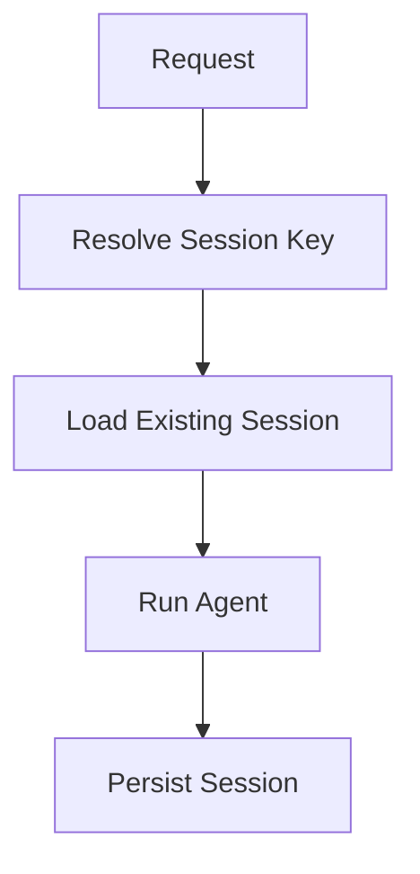

## 3. SessionManager

类似于 ToolManager / ToolRegistry 的基础设施组件，典型流程：

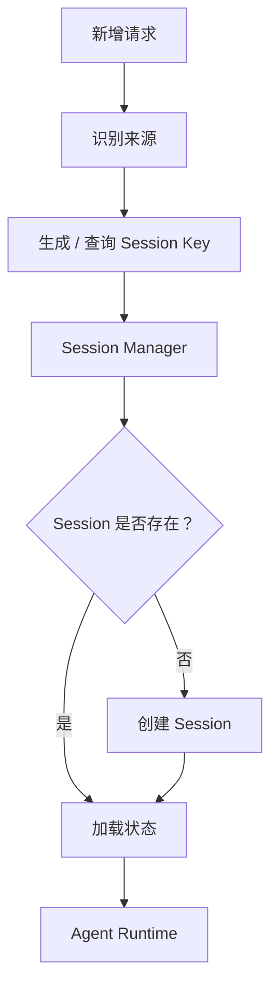

SessionManager 的职责是：根据来源（如 ChatID、OpenID、工作目录等）为每个请求分配独立的 Session 和历史消息，实现上下文逻辑隔离。

## 4. ToolRegistry 是否需要跟 Session 一起隔离

注册工具都是需要经过 `ToolRegistry` 的，一般的流程是这样：

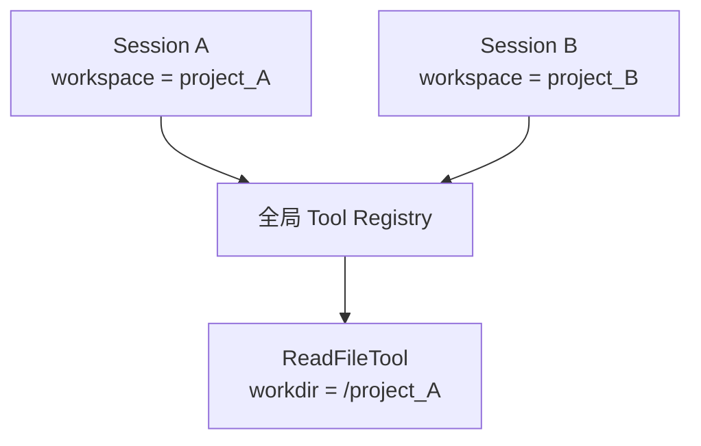

如果 ToolRegistry 不和 Session / Workspace 隔离，那么可能会出现这种情况：全局只注册了一个指向 `/project_A` 的 `ReadFileTool`，即使 Session B 的工作目录是 `/project_B`，它调用 `read_file(ui.py)` 时读到的仍然是 `/project_A/ui.py`。

因为工具对象可能是：

```python
class ReadFileTool:
    def __init__(self, workdir):
        self.workdir = workdir
```

系统启动时：

```python
registry.register(
    ReadFileTool("/project_A")
)
```

这就导致所有 Session 共用一个 `ReadFileTool` 实例，工作目录永远是 `/project_A`，读到的自然都是 `/project_A` 下的文件了。

### 追问

再注册一个 `ReadFileTool(project_B)` 不就行了吗？

问题：如果两个工具都叫 `read_file`，那 `Registry` 怎么区分？

如果 `Registry` 是：

```python
registry = {
    "read_file": tool_instance
}
```

那么你再注册：

```python
registry["read_file"] = ReadFileTool("/project_B")
```

只是把前面的工具实例覆盖了而已，结果无非就是变成所有 Session 下调用 `read_file` 时读到的都是 `/project_B` 下的文件，并没有改变。、

当然你也可以强行改成：`read_file_A`、`read_file_B`，但是这非常糟糕，因为 LLM 本来只应该知道 `read_file(path)`，现在却要知道那么多语义相同的工具。如果有 1000 个 Session，总不能注册 1000 个 `read_file`，这显然不合理。

### 结论

`project_A` 这种 Session/Workspace 级别的运行状态，不应绑定在全局 Tool 实例里面。全局 `Registry` 应该把两部分拆开，只注册 `read_file`————它是一个无状态的工具定义：

```python
registry.register("read_file", ReadFileTool())
```

而执行时：

```python
read_file.execute(
    runtime_context,
    path="main.ts"
)
```

其中 `runtime_context.workspace` 由当前 Session 决定。这样整个系统只需要一个全局的 `ToolRegistry`，只需要注册一个 `read_file`，只不过不同 Session 执行时有不同 `RuntimeContext` 罢了。

这其实类似 Web 后端中，Spring 里的 `UserService` 通常是单例，而你不会在 `UserService` 里写 `this.User = userA`，否则用户 B 请求进来时也可能用到 `userA`，而是 `userService.getProfile(currentUserId)`，其中 `currentUserId` 属于当前请求。Agent Tool 同理，Tool Definition 可以全局共享，Runtime State 必须按 Session / Request 隔离。

架构：

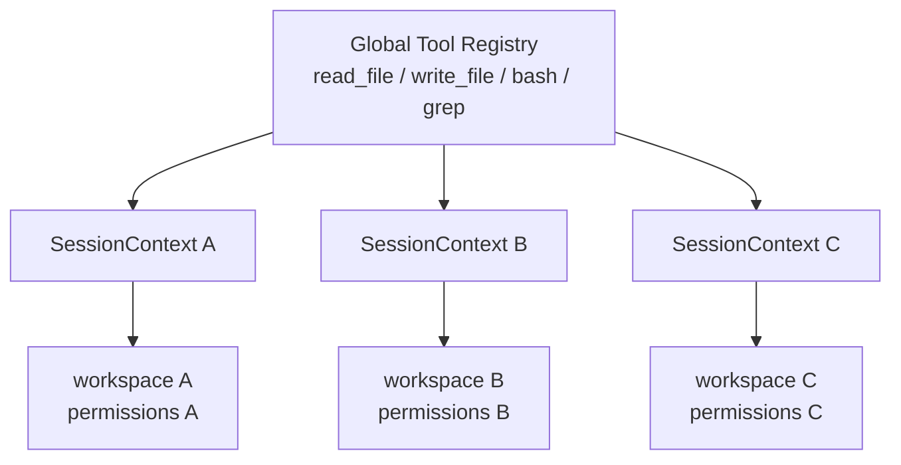

## 5. ToolRegistry

### 5.1 核心定义

**ToolRegistry 是 Agent Harness 里负责登记、查找和管理工具定义的组件。**

它回答的是：系统里有哪些工具？每个工具叫什么？参数是什么？怎么执行？模型能不能看到它？

### 5.2 为什么需要 ToolRegistry

一般来说，Coding Agent 至少需要 4 个工具：

- read
- write
- edit
- bash

~~其实我认为只需要这 4 个工具哈哈，够用了。~~

如果没有 `Registry` ，你可能需要直接写：

```python
if tool_name == "read_file":
    return read_file(args)

elif tool_name == "write_file":
    return write_file(args)

elif tool_name == "edit_file":
    return edit_file(args)

elif tool_name == "bash":
    return bash(args)
```

如果工具越来越多，会变成一个巨大的 `if-elif` 代码块。而且你还要解决：

- 工具叫什么？
- 工具描述是什么？
- 参数 schema 是什么？
- 哪个函数执行？
- 工具有没有注册？
- 是否允许重复注册？
- 当前 Agent 能用哪些工具？
- 如何把 Tool Schema 发给 LLM ？

所以我们将这些统一放入一个 `Registry`，这就是工具注册中心。最小版的 `ToolRegistry` 就是一个简单的字典：

```python
class ToolRegistry:
    def __init__(self):
        self.tools = {}

    def register(self, tool):
        self.tools[tool.name] = tool

    def get(self, name):
        return self.tools[name]

    def list_tools(self):
        return list(self.tools.values())
```

然后工具：

```python
class ReadFileTool:
    name = "read_file"
    description = "Read the contents of a file."

    def execute(self, path):
        ...
```

注册：

```python
registry = ToolRegistry()

registry.register(ReadFileTool())
registry.register(WriteFileTool())
registry.register(BashTool())
```

此时执行 `registry.get("read_file")` 就能得到对应工具。

### 5.3 对 LLM 的作用

LLM 并不天然知道你有 `read_file()`，你必须把工具定义告诉模型，例如模型可能会收到：

```JSON
{
  "name": "read_file",
  "description": "Read a file from the current workspace.",
  "parameters": {
    "type": "object",
    "properties": {
      "path": {
        "type": "string"
      }
    },
    "required": ["path"]
  }
}
```

### 5.4 总结

`ToolRegistry` 通常有两个方向的作用：

第一个：将 Tool Schema 提供给 LLM ，模型因此知道 “我能调用 `read_file(path)`”。

第二个：当模型返回：

```text
ToolCall:
name = "read_file"
args = {"path": "main.py}
```

Harness 再：

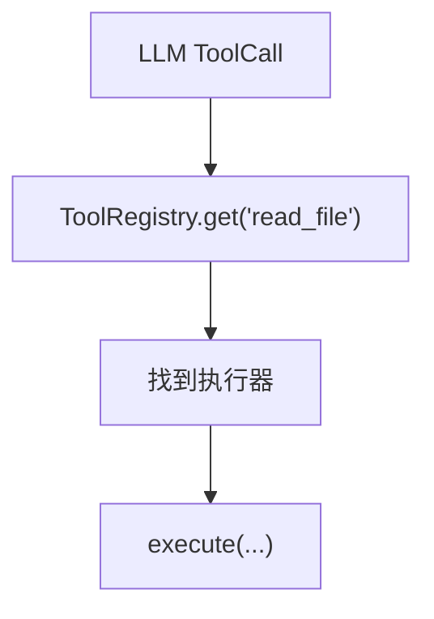

所以完整的链路是：

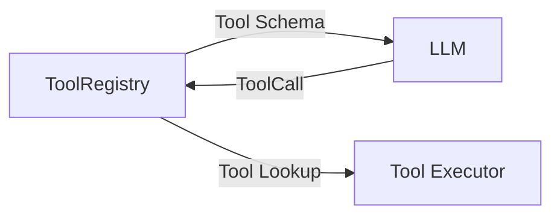

ToolRegistry 负责登记和查找工具定义。会话隔离中真正要关注的不是 Registry 本身，而是 Registry 中是否错误保存了 Session/Workspace 级可变状态。工具定义可以全局共享，运行时状态应通过 RuntimeContext 注入。ToolRegistry 的注册、Schema、动态工具发现、MCP 等细节放到后续工具管理篇。

补充讲了一下工具管理的内容，后面会详细讲解 Agent Harness 工具管理，本文不过多讲述。

## 6. 多租户 SaaS 场景下的会话隔离

### 6.1 Agent 的隔离层次

多租户 SaaS 场景下 Agent 的隔离层次设计：

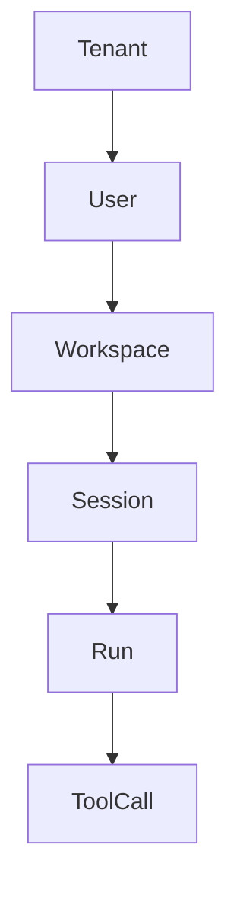

每一层都不是重复概念。

Tenant 回答：**这是哪一家客户组织？**

比如 `tenant_id = company_A`。

User 回答：**这是这个组织里的哪个成员？**

比如 `user_id = barrus`。

Workspace 回答：**当前 Agent 在操作哪一组资源？**

例如 `project_X`、`repo_A`、`knowledge_base_7`。

Session 回答：**这是哪一个独立任务/对话？**

例如“修复登录 bug”、“重构 ui 逻辑”。

Run 回答：**这一次 Agent 执行是哪一次？**

因为一个 Session 会经历很多次 Run。

ToolCall 回答：**这是这次 Run 中具体哪一次工具执行？**

所以一个完整的 key 可以在概念上理解为：

- tenant_id
- user_id
- workspace_id
- session_id
- run_id
- tool_call_id

### 6.2 多租户 SaaS 下如何做会话隔离

分五层来做。

#### 6.2.1 第一层：身份隔离——Tenant/User 不能由客户端随便传

这是毋庸置疑的安全原则。你不能允许客户端传入一个 `"tenant_id": "company_B"` 然后后端就相信：“好，你就是 company_B。”

正确流程应该是：

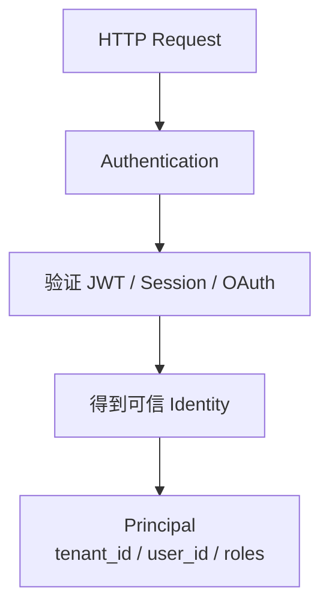

这就是 Web 后端的那一套了。后面的所有组件全部使用这个服务端验证过的 `principal`。也就是说，`tenant_id` 是认证/授权上下文的一部分，不只是一个普通请求参数。

#### 6.2.2 第二层：Session 必须被 Tenant Namespace 包起来

假设两个公司都有 `session_id = abc123`，如果数据库直接：

```SQL
SELECT *
FROM sessions
WHERE session_id = 'abc123';
```

那设计上就是危险的。逻辑身份应当由 `tenant_id` 和 `session_id` 一起构成。SQL 语句中应当增加对应的查询条件，或者直接 `SessionKey = tenant_id + ":" + session_id`，这样 Session 在根上就是租户域的。

#### 6.2.3 Workspace 也必须是租户域的

理由同上。不加 tenant 条件，还是可能越权。所以 `WorkspaceKey = tenant_id + workspace_id`，并且加载时必须验证 `workspace.tenant_id == session.tenant_id`，最好 `ORM/Repository` 层就天然是租户域的。

#### 6.2.4 Tool Runtime 不能相信 LLM 给的 tenant / workspace

这就是 Agent 老生常谈的问题：LLM 给你错误信息，怎么处理？例如模型可能生成：

```JSON
{
  "path": "/tenant_B/secret.txt"
}
```

绝对不能因为这是模型生成的工具参数就相信它。对于这种涉及隐私信息的情况，作为开发者，一定要假设模型一定会给你错误信息。

正确的架构是：

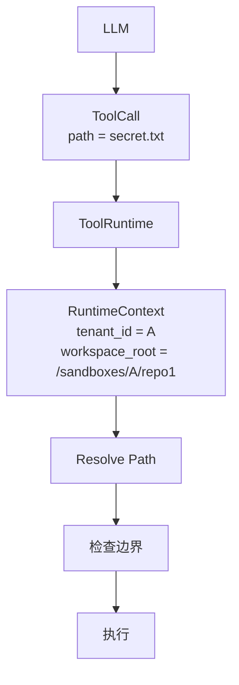

这里其实更像是做工具权限的内容，也会在后续内容中详细说。总而言之，LLM 只能表达“我想做什么”，至于它能不能做，必须要经过 Harness 层的审核。

#### 6.2.5 数据库、缓存、对象存储、向量库都要 Tenant-aware

不仅仅只有 API 层需要做租户隔离，理由也是一样的。比如 Redis：`tenant:{tenant_id}:session:{session_id}`，对象存储：`tenant_A/artifacts/...`。

所以多租户隔离并不只是 `SessionManager` 多加个 `if` 这么简单，而是要确保租户认证贯穿数据和执行全流程。

#### 6.2.6 我如何设计一个 Agent SaaS 的 Session 架构？

大概这样：

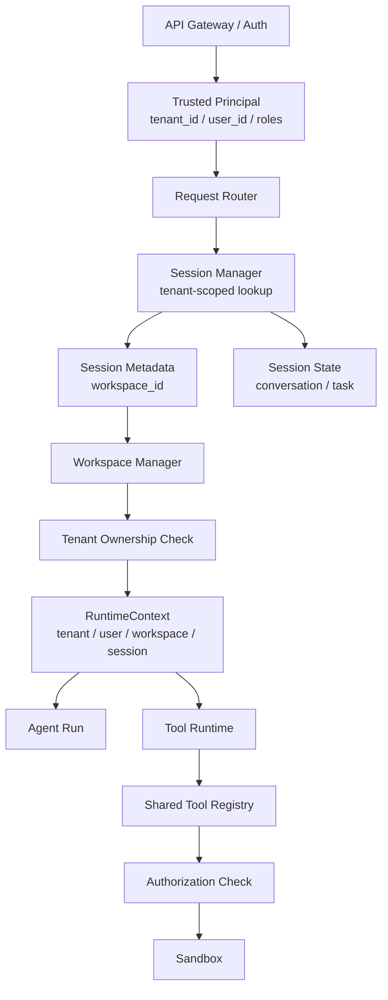

其实还有一些内容与工具管理有重叠，我放到后续的工具管理篇再来讲解。
