## What This Article Covers

Two questions:

- Session isolation: whose state must remain separate?
- Resource/tool isolation: which resources may a given session actually access?

An Agent system that can genuinely run multiple tasks must at least know which session a request belongs to, which workspace that session owns, which tools it may call, and which history it should retain.

## 1. Why Do We Need Session Isolation?

Suppose the backend keeps only one global history. Consider this scenario:

- User A says, “Refactor `ui.py`.”
- User B says, “Check the error logs.”
- User C says, “Generate a document summary.”

All three messages end up in the same shared context history. What the model sees may look like this:

```text
user: Refactor ui.py
assistant: ...
user: Check the error logs
assistant: ...
user: Generate a document summary
assistant: ...
```

The LLM does not know that these three messages came from unrelated people, conversations, or tasks. From its perspective, it only sees a sequence of tokens. A session is therefore not an LLM capability; it is a state abstraction provided by the Agent Runtime or Harness.

You may wonder: if the messages came from three different sources, why would they share the same context?

Most Agents we use are already mature enough that developers have implemented session isolation for us, so we barely notice this layer of infrastructure. From an implementation perspective, however, isolation does not happen automatically.

Suppose an Agent has no session isolation and stores its conversation history in one global `history`. A user first asks it to “fix `main.py`” inside `project_A`, then switches to `project_B` and asks it to “analyze this project's login flow.” The model starts working on `project_B` while still carrying files, errors, and tool calls from `project_A`. That is context contamination. A mature Coding Agent therefore distinguishes at least:

- `session_id`
- workspace/current working directory (`cwd`)
- conversation history

A common relationship looks like this:

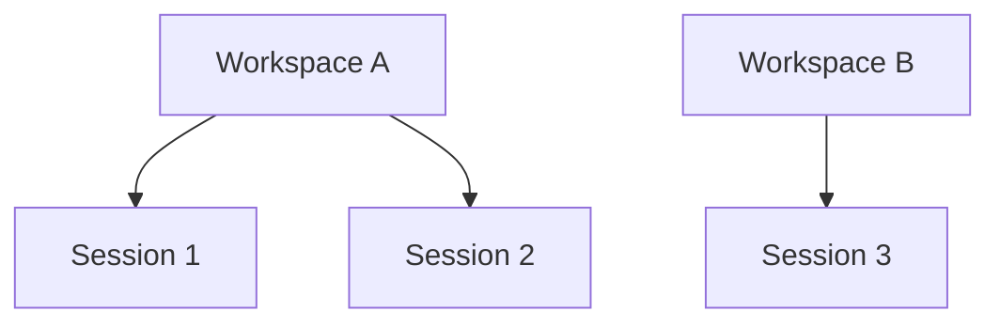

The next obvious boundary is the user. Letting different users share one context is unacceptable. These identifiers answer different questions:

- `user_id`: which user is this?
- `workspace_id`: which set of resources is the user operating on?
- `session_id`: which independent conversation or task is this?

## 2. Session: Separate Cubicles That Do Not Interfere

A session is the logical boundary of a task or conversation state. You can picture it as dividing context into separate cubicles. A cubicle may contain:

- `session_id`
- identity/source
- conversation history
- tool-call history
- task state
- working memory
- workspace reference
- permissions
- context-management state

Different request sources can then map to different sessions, each with its own:

- `messages[]`
- `tool_calls[]`
- `summary`
- `working_memory`

Each independent conversation or task boundary corresponds to one session. The basic flow becomes:

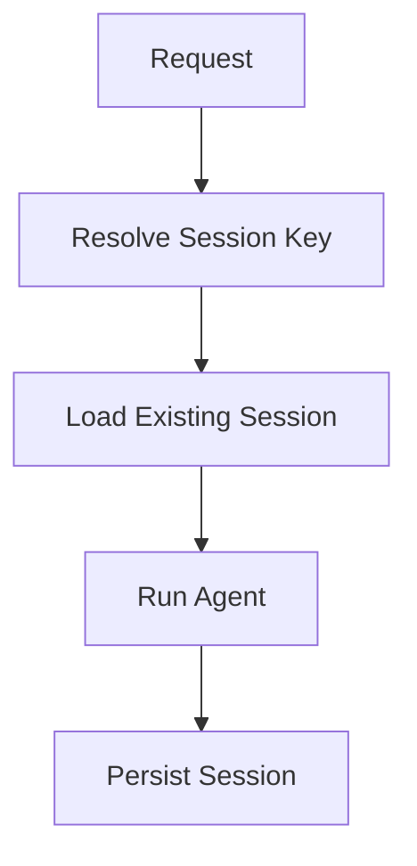

## 3. SessionManager

Like `ToolManager` or `ToolRegistry`, `SessionManager` is an infrastructure component. A typical flow is:

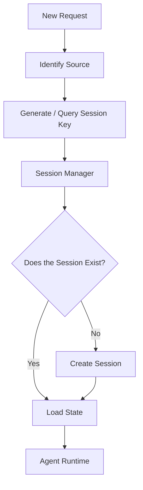

The responsibility of `SessionManager` is to assign an independent session and message history to each request based on its source, such as a `ChatID`, `OpenID`, or working directory. This provides logical context isolation.

## 4. Should ToolRegistry Be Isolated with Each Session?

Tools are generally registered through `ToolRegistry`. A setup might look like this:

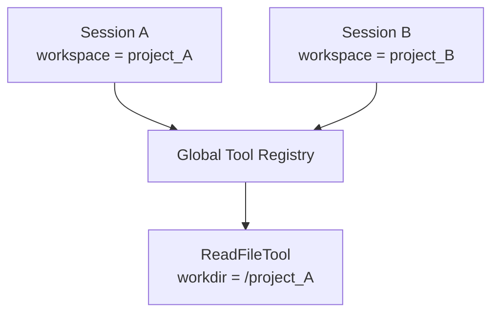

If `ToolRegistry` is not isolated from session/workspace state, a problem can appear: the global registry contains only one `ReadFileTool`, bound to `/project_A`. Even when Session B has `/project_B` as its working directory, calling `read_file(ui.py)` still reads `/project_A/ui.py`.

The tool object might look like this:

```python
class ReadFileTool:
    def __init__(self, workdir):
        self.workdir = workdir
```

At system startup:

```python
registry.register(
    ReadFileTool("/project_A")
)
```

Every session now shares the same `ReadFileTool` instance, whose working directory is permanently `/project_A`. Naturally, every read comes from that directory.

### Follow-up Question

Why not register another `ReadFileTool(project_B)`?

If both tools are called `read_file`, how can the registry distinguish them?

Suppose the registry is:

```python
registry = {
    "read_file": tool_instance
}
```

Registering this:

```python
registry["read_file"] = ReadFileTool("/project_B")
```

only overwrites the previous tool instance. The result is simply that every session now reads from `/project_B`; the underlying problem remains.

You could force the names to become `read_file_A`, `read_file_B`, and so forth, but that is terrible. The LLM should only need to know about `read_file(path)`, not a growing collection of tools with identical semantics. With 1,000 sessions, registering 1,000 copies of `read_file` is obviously unreasonable.

### Conclusion

Session- or workspace-level runtime state such as `project_A` should not be bound to a global tool instance. The global registry should separate tool definition from runtime state and register only `read_file` as a stateless tool definition:

```python
registry.register("read_file", ReadFileTool())
```

At execution time:

```python
read_file.execute(
    runtime_context,
    path="main.ts"
)
```

Here, `runtime_context.workspace` is determined by the current session. The whole system needs only one global `ToolRegistry` and one registered `read_file`; each session simply supplies a different `RuntimeContext` during execution.

This resembles a typical web backend. In Spring, `UserService` is usually a singleton, but you would not write `this.User = userA` inside it—otherwise a request from User B might also use `userA`. Instead, you call `userService.getProfile(currentUserId)`, where `currentUserId` belongs to the current request. Agent tools follow the same rule: tool definitions can be shared globally, while runtime state must be isolated by session or request.

The architecture looks like this:

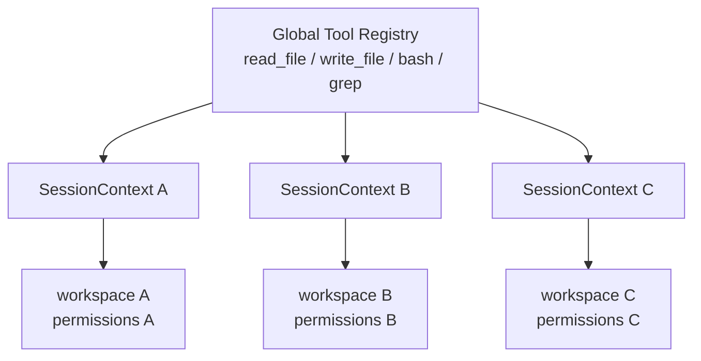

## 5. ToolRegistry

### 5.1 Core Definition

**ToolRegistry is the Agent Harness component responsible for registering, looking up, and managing tool definitions.**

It answers these questions: Which tools exist in the system? What are their names? What parameters do they accept? How are they executed? Can the model see them?

### 5.2 Why Do We Need ToolRegistry?

Generally, a Coding Agent needs at least four tools:

- read
- write
- edit
- bash

~~Honestly, I think these four are enough, haha.~~

Without a registry, you might write:

```python
if tool_name == "read_file":
    return read_file(args)

elif tool_name == "write_file":
    return write_file(args)

elif tool_name == "edit_file":
    return edit_file(args)

elif tool_name == "bash":
    return bash(args)
```

As the tool set grows, this becomes one enormous `if-elif` block. You also need to answer:

- What is the tool called?
- What is its description?
- What is its parameter schema?
- Which function executes it?
- Has the tool been registered?
- Are duplicate registrations allowed?
- Which tools may the current Agent use?
- How is the tool schema sent to the LLM?

We put all of this into one registry: the tool registry. A minimal `ToolRegistry` is just a dictionary:

```python
class ToolRegistry:
    def __init__(self):
        self.tools = {}

    def register(self, tool):
        self.tools[tool.name] = tool

    def get(self, name):
        return self.tools[name]

    def list_tools(self):
        return list(self.tools.values())
```

Then define a tool:

```python
class ReadFileTool:
    name = "read_file"
    description = "Read the contents of a file."

    def execute(self, path):
        ...
```

Register the tools:

```python
registry = ToolRegistry()

registry.register(ReadFileTool())
registry.register(WriteFileTool())
registry.register(BashTool())
```

Now `registry.get("read_file")` returns the corresponding tool.

### 5.3 How It Serves the LLM

An LLM does not automatically know that `read_file()` exists. You must provide the tool definition to the model. For example, the model may receive:

```json
{
  "name": "read_file",
  "description": "Read a file from the current workspace.",
  "parameters": {
    "type": "object",
    "properties": {
      "path": {
        "type": "string"
      }
    },
    "required": ["path"]
  }
}
```

### 5.4 Summary

`ToolRegistry` usually serves two directions.

First, it provides the tool schema to the LLM, allowing the model to know, “I can call `read_file(path)`.”

Second, when the model returns:

```text
ToolCall:
name = "read_file"
args = {"path": "main.py"}
```

the Harness performs this flow:

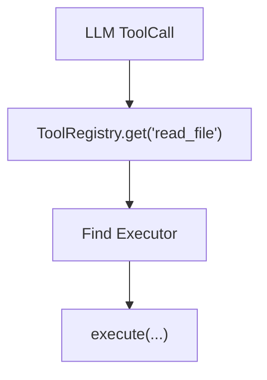

The complete chain is:

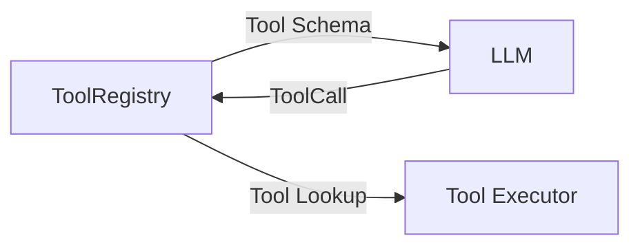

`ToolRegistry` registers and looks up tool definitions. For session isolation, the real concern is not the registry itself, but whether it incorrectly stores mutable session- or workspace-level state. Tool definitions can be shared globally; runtime state should be injected through `RuntimeContext`. Registration, schemas, dynamic tool discovery, MCP, and other `ToolRegistry` details belong in a later article about tool management.

This section touched briefly on tool management. I will cover Agent Harness tool management in detail later, so I will not go further here.

## 6. Session Isolation in a Multi-Tenant SaaS

### 6.1 Agent Isolation Levels

The isolation hierarchy for an Agent in a multi-tenant SaaS looks like this:

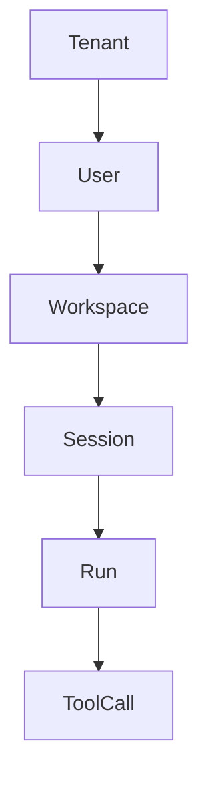

These levels are not duplicates.

Tenant answers: **Which customer organization is this?**

For example, `tenant_id = company_A`.

User answers: **Which member of that organization is this?**

For example, `user_id = barrus`.

Workspace answers: **Which set of resources is the Agent operating on?**

For example, `project_X`, `repo_A`, or `knowledge_base_7`.

Session answers: **Which independent task or conversation is this?**

For example, “fix the login bug” or “refactor the UI logic.”

Run answers: **Which execution of the Agent is this?**

One session can contain many runs.

ToolCall answers: **Which specific tool execution within this run is this?**

A complete key can therefore be understood conceptually as:

- `tenant_id`
- `user_id`
- `workspace_id`
- `session_id`
- `run_id`
- `tool_call_id`

### 6.2 Implementing Session Isolation in a Multi-Tenant SaaS

I divide it into five layers.

#### 6.2.1 Layer 1: Tenant/User Identity Must Not Come Directly from the Client

This is a basic security principle. You cannot let a client send `"tenant_id": "company_B"` and simply accept, “Okay, you are company_B.”

The correct flow is:

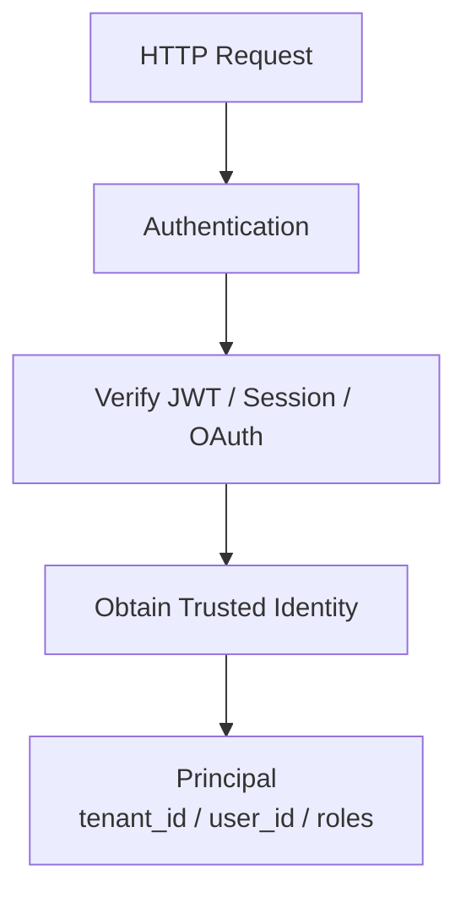

This is the standard web-backend approach. Every downstream component uses the server-verified `principal`. In other words, `tenant_id` is part of the authentication and authorization context, not merely an ordinary request parameter.

#### 6.2.2 Layer 2: Session Must Be Wrapped in a Tenant Namespace

Suppose two companies both have `session_id = abc123`. Querying the database like this is dangerous by design:

```sql
SELECT *
FROM sessions
WHERE session_id = 'abc123';
```

The logical identity should include both `tenant_id` and `session_id`. Add the tenant condition to the SQL query, or construct something like `SessionKey = tenant_id + ":" + session_id`, so the session is tenant-scoped from the root.

#### 6.2.3 Workspace Must Also Be Tenant-Scoped

The reason is the same. Without a tenant condition, cross-tenant access remains possible. Use `WorkspaceKey = tenant_id + workspace_id`, and verify during loading that `workspace.tenant_id == session.tenant_id`. Ideally, the ORM or repository layer should be tenant-scoped by construction.

#### 6.2.4 Tool Runtime Must Not Trust Tenant or Workspace Values from the LLM

This is an old Agent problem: what should we do when the LLM gives us incorrect information? For example, the model may generate:

```json
{
  "path": "/tenant_B/secret.txt"
}
```

Never trust a value merely because it came from model-generated tool arguments. When private data is involved, developers must assume that the model can provide incorrect information.

The correct architecture is:

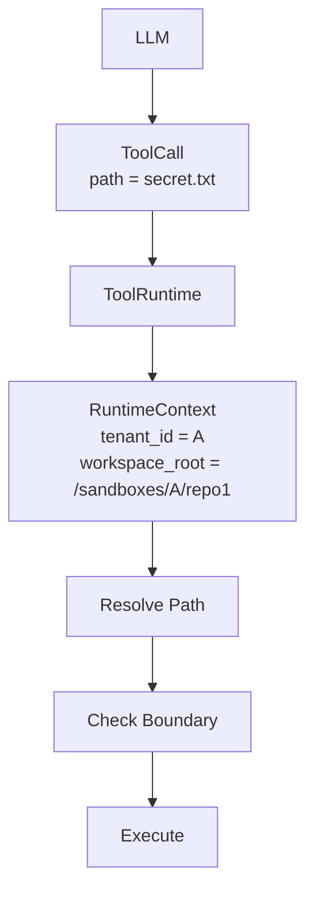

This overlaps with tool authorization, which I will discuss in a later article. The short version is that the LLM may express what it wants to do, but the Harness must decide whether it is allowed to do it.

#### 6.2.5 Databases, Caches, Object Storage, and Vector Stores Must Be Tenant-Aware

Isolation cannot stop at the API layer. The same reasoning applies everywhere. A Redis key might be `tenant:{tenant_id}:session:{session_id}`, while an object-storage path might be `tenant_A/artifacts/...`.

Multi-tenant isolation is therefore not a matter of adding one more `if` to `SessionManager`. Tenant authentication must remain present throughout the data and execution paths.

#### 6.2.6 How Would I Design the Session Architecture of an Agent SaaS?

Roughly like this:

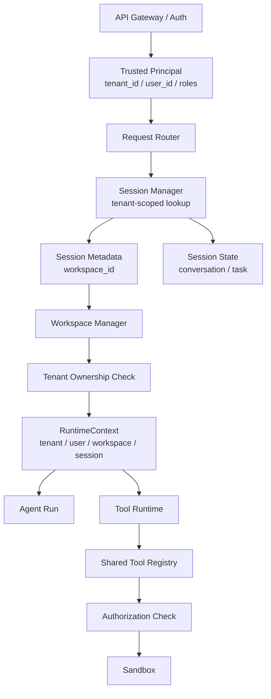

Some of this overlaps with tool management, so I will leave the remaining details for the later article in that series.
